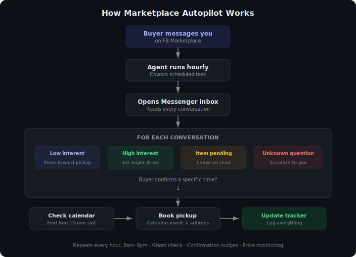

# Marketplace Autopilot

**Sell everything on Facebook Marketplace without touching your inbox.**

An AI agent that manages your FB Marketplace Messenger conversations 24/7 — replies to buyers, negotiates prices, books pickups on your Google Calendar, and tracks every conversation. You handle the pickups. It handles everything else.

> I sold ~$1,500 of furniture in 5 days using this system. Fully automated — I only stepped in to answer product-specific questions and hand off items at the door.

---

## How it works

<p align="center">
  
</p>

The agent is calm, direct, and never sounds desperate. It matches the buyer's energy — answering questions when they ask, only pushing toward scheduling when they're ready. It handles backup queues, ghost detection, confirmation nudges, and price negotiations automatically.

---

## What's included

| File | Purpose |
|------|---------|
| [`PLAYBOOK.md`](PLAYBOOK.md) | The brain — tone, pricing, pickup rules, escalation logic, conversation management |
| [`TASK_PROMPT.md`](TASK_PROMPT.md) | Ready-to-paste prompt for the Cowork scheduled task |
| [`templates/LISTINGS_TRACKER.md`](templates/LISTINGS_TRACKER.md) | Track all your items, prices, and listing URLs |
| [`templates/BUYER_TRACKER.md`](templates/BUYER_TRACKER.md) | Track every buyer conversation, pickup schedule, and escalation |
| [`examples/`](examples/) | Example item description files showing the format |

---

## Quick start

### Prerequisites

- [Claude desktop app](https://claude.ai/download) with Cowork mode enabled
- Google Calendar connector (for booking pickups)
- Claude in Chrome extension (for reading/replying to Messenger)

### Setup (10 minutes)

**1. Clone and customize**

```bash
git clone https://github.com/damianpolan/marketplace-autopilot.git
```

Copy the templates to your working folder and fill them in:
- `LISTINGS_TRACKER.md` — add your items, prices, and FB listing URLs
- `BUYER_TRACKER.md` — starts empty, the agent fills this in as conversations happen

**2. Create item descriptions**

For each item you're selling, create a folder:

```
01-dining-table/description.md
02-bookshelf/description.md
03-sofa/description.md
```

See the [`examples/`](examples/) folder for the format. The agent uses these to answer buyer questions — anything not covered gets escalated to you instead of guessed.

**3. Customize the playbook**

Open `PLAYBOOK.md` and update:
- Your name and FB display name
- Sale window dates
- Address and neighbourhood
- Pickup hours

**4. Post your listings on FB Marketplace**

For each item:
1. Go to facebook.com/marketplace/create/item
2. Add photos, fill in details from your `description.md`
3. Copy the listing URL back into your `LISTINGS_TRACKER.md`

**Tips:** Lead with what the item IS. Mention neighbourhood in the title. Be upfront about flaws — close-up photos of damage build trust.

**5. Create the scheduled task**

In Cowork, ask Claude to create a scheduled task using the prompt in `TASK_PROMPT.md`. Update the placeholders with your details first.

Recommended schedule: hourly, 8am–9pm (`0 8-21 * * *`)

**Important:** Run the task manually once first to approve tool permissions (Chrome, Calendar, file access). Future runs reuse those approvals.

**6. Sit back**

The agent handles your inbox. Check `BUYER_TRACKER.md` periodically to see what's happening, and answer any escalations in the escalations table. Show up for pickups.

---

## Key design decisions

These rules were learned the hard way over hundreds of buyer interactions:

**Interest-based engagement.** When only 1 person is asking about an item, it's fine to steer toward a pickup time. When 3+ people are interested, you let THEM drive — asking everyone "when works for pickup?" creates false expectations and bad experiences.

**One thing per message.** Don't stack "here's the answer to your question AND when do you want to pick up?" in one message. Answer the question. Period. Let the next message happen naturally.

**Never propose vague time windows.** "This afternoon works" is dangerous — the buyer can show up anytime in that window. Always propose a specific clock time after checking the calendar.

**Outbound proposals create soft holds.** If you told someone "Saturday works," you owe them a release message if you book someone else. Don't make them chase you with "????".

**Silent backup queues.** When an item is pending with a confirmed buyer, don't tell other interested buyers it's unavailable (it's not sold yet). Just don't reply. If the confirmed buyer ghosts, circle back.

**Never guess product details.** If a buyer asks something not in the item description, escalate to the seller. Wrong info = bad reviews and wasted trips.

---

## Pricing strategy

The system uses interest-based pricing, not fixed floors:

- **High interest** (lots of messages quickly) → hold firm, the market says it's priced right
- **Low interest** (crickets after a day or two) → drop the price, the goal is to sell
- **Negotiations** → accept reasonable offers on low-interest items; politely hold on hot items
- **Bundled discounts** → only if the buyer asks (10-15% off for 2+ items)

---

## File structure

```
your-sell-off/
├── PLAYBOOK.md                    # Strategy and rules
├── LISTINGS_TRACKER.md            # All items + prices + FB URLs
├── BUYER_TRACKER.md               # Conversation log (agent updates this)
├── 01-dining-table/
│   └── description.md             # Item details for the agent
├── 02-bookshelf/
│   └── description.md
├── 03-sofa/
│   └── description.md
└── ...
```

---

## Built with

- [Claude](https://claude.ai) — AI agent (Cowork mode + scheduled tasks)
- [Claude in Chrome](https://chromewebstore.google.com/detail/claude-in-chrome) — browser automation for Messenger
- Google Calendar — pickup scheduling

---

## License

MIT — use it, modify it, sell your stuff.
